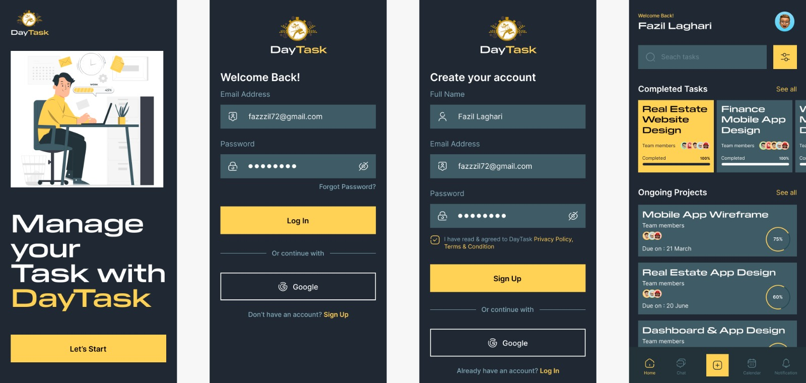

# DayTask - A Task Management App

**DayTask** is a task management app built with Flutter, inspired by a free Figma design. 

The app is designed to help users manage their projects and tasks efficiently. It features a clean and modern design, with support for localization and best practices in app development. DayTask uses Firebase Auth for user authentication and Cloud Firestore for handling project and task data.

### Features
- Sign In/Sign Up functionality with Firebase Auth
- Project and Task management using Cloud Firestore
- Localization support for multiple languages
- Clean and modern design based on a free Figma template
- Implementation of best practices in Flutter development

## Getting Started
### Prerequisites
- Flutter SDK
- Firebase account
- Android Studio or Visual Studio Code with Flutter and Dart plugins

## Setup

Clone the repository:
> git clone https://github.com/yourusername/DayTask.git

Navigate to the project directory:
> cd DayTask

Install dependencies:
> flutter pub get

Update all *.samples files with the correct information

Run the app:

> flutter run
